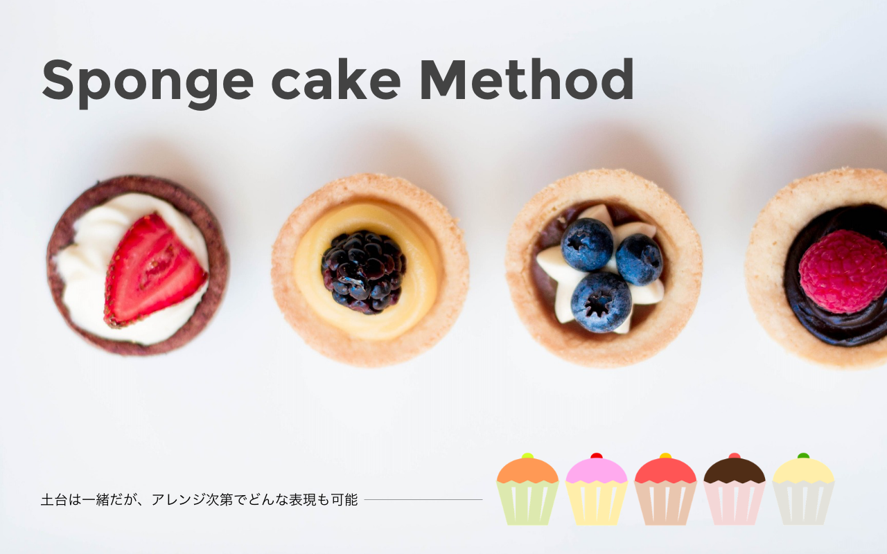

# スポンジケーキ デザインメソッドとは

Photo by [Pexels](https://pixabay.com/ja/%E3%82%B1%E3%83%BC%E3%82%AD-%E3%83%95%E3%83%AB%E3%83%BC%E3%83%84-%E3%83%87%E3%82%B6%E3%83%BC%E3%83%88-%E3%81%8A%E3%81%84%E3%81%97%E3%81%84-%E3%82%A4%E3%83%81%E3%82%B4-%E3%83%99%E3%83%AA%E3%83%BC-%E8%8F%93%E5%AD%90-1283821/) and Illustration by [creades](https://pixabay.com/ja/%E3%82%B1%E3%83%BC%E3%82%AD-%E3%83%9E%E3%83%95%E3%82%A3%E3%83%B3-%E3%83%9A%E3%82%B9%E3%83%88%E3%83%AA%E3%83%BC-%E3%82%AB%E3%83%83%E3%83%97%E3%82%B1%E3%83%BC%E3%82%AD-%E5%96%9C%E3%81%B3-%E7%94%98%E3%81%84-%E9%A3%9F%E5%93%81-1953211/)

[イシジマ ミキ](mikiishijima.com)によって提唱された、初学者向けデザイン手法。

センスや表現力が重要だと萎縮して、最初に一歩をどう踏み出していいか分からないノンデザイナーに向けて、「**手順通りにステップを踏めば、基礎が完成する**」手法として発案。

デコレーションが主要と勘違いされがちなグラフィックデザインが、実は「情報の整理」からはじまっていると理解してもらいやすい流れとなっている。

## 本稿で扱うデザインの範囲
* グラフィックデザイン
* ウェブデザイン
	* インターフェイス設計の前の情報デザイン

## 対象
* デザインに興味がないが行う義務・予定がある人
* 業務で簡単なデザインを行うことがある人
* 自身の感性を信用できない人

## 目的
デザイン作業の中のセンス以外の部分を定型化する事。

「何が良くて何がいけないのか」自身の感性に自信がなく、制作や判断が難しいと考えている人が、デザインが必ず達成するべき項目の100点中50点がとれ、「完璧ではないが、間違いではない」デザインを実践できるようになることを目標にしている。

## 解決する課題
* 感性による制作・評価の負担を軽減
* デザイン作業の一部を定型化し、教えやすく

## 由来
デザインのロジック部分を定型化することでケーキの土台のように、

1. 作りやすい
1. 量産しやすい
1. アウトソースしやすい
1. コラボレーションしやすい
1. アレンジしやすい
1. 段重ねしやすい

ことをに由来する

## スポンジケーキデザインメソッド
### cake1: 情報を整理する
* 近接と対比を繰り返す
  1. 情報を洗い出す
  1. 関連する情報を隣接させる(グループ化/近接)
  1. 優先順位をつける(ジャンプ率/対比)
  1. 決まった役割のあるものを定位置へ配置する
  1. それ以外のものを上から下へ順番に並べていく
  1. 配置したグループ内で2-4を繰り返していく  
* 最後に、整列と反復で整える

---

## TODO
1. cake1の作例を用意
  1. 原稿用意
  1. 素材用意
  1. フローに則って作業
  1. 動画収録
  1. アニメーションGIF化
  1. レビュー
  1. 本稿に掲載
1. cakeになりそうなものを広く募る
  1. メール or メンションを受けられるようにする
1. cakeを増やす
  1. cake化(定型化)できそうなデザイン中の作業をピックアップ
  1. フローを作ってみる
  1. 複数人でひとつの原稿をフローに則って作業する
  1. フィードバック → フローアップデート → ループ
  1. 複数の原稿を複数の人間がフローに則って作業する
  1. フィードバック → フローアップデート → ループ
  1. cake1と同様のフローで作例を用意する
1. 英語版の原稿をつくる
1. サイトを作る

## コントリビューター募集

[イシジマ ミキ | Twitter](https://twitter.com/woopsdez)宛に、TODOのどの部分をコントリビューション可能かメンションください。

とくに、作例用のサンプル原稿を用意するのはすっごく苦手なので、手伝っていただけると非常に嬉しいです。
